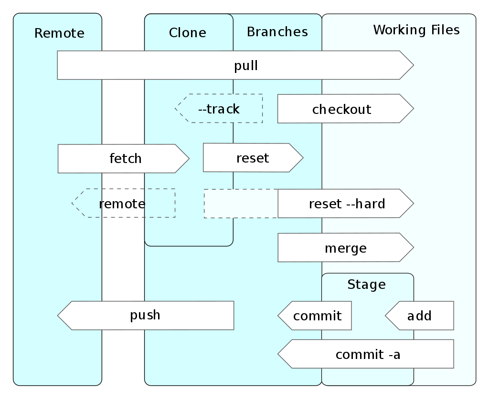

% Introduction to GIT
% Jean-Baptiste Aubort; EPFL//VPSI//EXOP
% \today

# Summary
<!-- http://johnmacfarlane.net/pandoc/demo/example9/pandocs-markdown.html -->

* History of GIT
* Hands on GIT
    * add/commit
    * clone/remote/pull/push
    * branch/checkout
    * log/show/tig
    * hooks
* How it works
* Share repositories
    * github.com
    * git.epfl.ch
    * SSH/HTTP

# Introduction to GIT


# History of GIT

> Git is a distributed revision control system with an emphasis on speed,
 data integrity, and support for distributed, non-linear workflows.
 Git was initially designed and developed by Linus Torvalds for Linux kernel
 development in 2005, and has since become the most widely adopted version
 control system for software development. **Wikipedia, The free encyclopedia.**

* Created by Linus Torvalds for the Linux kernel in 2005 to replace non-free BitKeeper
* Written in C and shell script, most of the shell scripts replaced by pure C for performance

# Hands on GIT
## Installing

* Windows: use git-bash !! You have a very nice CLI with tools and GIT
* Debian/Ubuntu: apt-get install git

## status/add/commit

```
git init
touch hello
git status
git add hello
git status
git commit -m "First commit"
```

```
echo world > ./hello
git status
git diff
git commit -am "Adding content"
```

## clone/remote/pull/push

```
git clone ssh://user@myserver.tld/repo
git remote add myserver ssh://user@myserver.tld/repo
git pull origin master
git push myserver master
```

# Hands on GIT
## branch/checkout

* Create a new branch from HEAD
```
git branch MyBranch HEAD
git checkout MyBranch
```
> equivalent to
```
git checkout -b MyBranch HEAD
```

* Deleting

```
git branch -d MyBranch
git branch -D MyBranch
```

# Hands on GIT
## branch/merge/checkout

* Branching for a feature and merge back

```
git checkout -b MyBranch HEAD^
echo test >> ./hello
git commit -am "New feature"
git pull master
git checkout master
git merge MyBranch
```

* Result

```
*   92b8ca5 Fix conflict
|\
| * 25e7adc Adding content
* | ba058ef New feature
|/
* 540ad1d First commit
```

# Hands on GIT
## stash

```
git stash
git stash show
git stash apply
```

# Hands on GIT
## log/tig

```
git log
git log HEAD^
```

## ls-tree/show/grep

```
git ls
git ls-tree HEAD
git show HEAD
git grep MyString
```

## hooks

```
echo "echo TEST"  > .git/hooks/pre-commit
chmod +x .git/hooks/pre-commit
git touch test
git add test
git commit -m "commit message"
```

# Hands on GIT



# How it works

* Created to work like a filesystem, with versioning
* Composed of two data structures
    * Index (mutable)
    * Object database (immutable), identified by a SHA-1 hash
        * Blob: Binary object, each file is stored as a blob compressed with zlib
        * Packs: Objects are packed together (by similarity) and delta-compressed, a pack index is created to keep track of files
        * Tree: File names, persmission, hierarchy
        * Commit: Reference a tree object with timestamp and log message
        * Tag: Contains other object for reference (usually commits)

# Share repositories
## github.com

* Social network around git: follow, comment
* Projet management: Wiki, Bug report, Website, Statistics, Release (tags), fork
* Team managment: Groups, branch, pull requests
* Integration: Webhooks (to REST API), Services (Jenkins, Bugzilla, a lot and lot of services)
* Access by SSH keys or login
* Access via different protocols: SSH, HTTPS or SVN
* Quota: 1GB per repository (soft limit), 100MB per file

## git.epfl.ch

* Acces via HTTPS using EPFL gaspar account
* Manage user and groups via EPFL gaspar username and groups.epfl.ch
* Git can save password locally using git credentials (in memory, os keyring or text file)
* Commit notification by email (by service-side hook)
* Quota: 2GB per repository

## SSH/HTTP

* Simply put the bare repository accessible via an HTTP server or via SSH in a shared directory
```
git clone --bare http://originalrepo /path/to/copy
git clone --bare /path/to/original /path/to/copy
```
* Git also has an http server built-in

#References

## Title 2
* <https://git-scm.herokuapp.com/documentation/>
* <http://www-cs-students.stanford.edu/~blynn/gitmagic/>
* <https://marklodato.github.io/visual-git-guide/index-en.html>
* <http://ndpsoftware.com/git-cheatsheet.html>
* <https://github.com/esc/git-big-picture>
* List of Torvalds insults in 2014 <http://flossdata.syr.edu/data/insults/2014LTinsultsLKML.tsv.txt>
